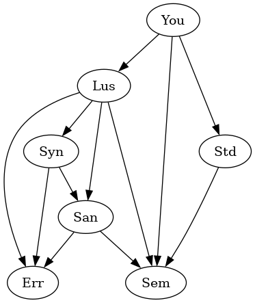

# Chandeliers

A deep embedding of Lustre in Rust.

---

## Structure

The Chandeliers suite is split in many crates:
- public
    - `chandeliers-lus`: the main frontend of Chandeliers.
        This crate defines one macro: `decl`. This macro takes as input the
        source code of a Lustre program and generates equivalent Rust code.
        Examples of usage are shown below.
    - `chandeliers-sem`: semantics of the target language.
        This crate is useful if you want to interface Lustre with Rust.
        It defines the traits that Lustre nodes implement, conversion functions
        to and from the internal representation of Lustre, and some basic macros
        that are helpful if you want to write extern nodes.
    - `chandeliers-std`: standard library for Lustre.
        All nodes (`struct`s) defined in this crate can be imported and used as
        `extern node` to provide features that are not implementable directly
        in Lustre (typecasts, randomness, ...). See the crate documentation for
        all the items provided.
- internal
    - `chandeliers-err`: error message helpers.
    - `chandeliers-syn`: definition of the parsing AST, translation to the analysis AST.
    - `chandeliers-san`: static analysis, typechecking, codegen, etc.


The dependency graph of the Chandeliers suite, and the recommended crates
that you should use as direct dependencies.

You would typically depend on
- `chandeliers-sem` only if you want to write a library for Lustre,
- `chandeliers-lus` only if you want to write basic self-contained programs,
- `chandeliers-lus` and `chandeliers-std` if you need more advanced features,
- all of the above if you want to interface Lustre with Rust, e.g. to write a
  `main` function that isn't handled by a simple `#[main]`.

Under no circumstance should you find the need to have `chandeliers-syn`,
`chandeliers-san`, or `chandeliers-err` as direct dependencies. Their definitions
are `pub`, but their interface is very unstable and they are only useful when used
together anyway.

Note: all the crates of Chandeliers are published simultaneously and with the same
version number. As a result, `std` or `sem` may receive a version update even though
nothing in their source code has changed, just so that the version numbers do not
get out of sync with those of `syn` and `san` that change much more often.
It is not recommended to have different version numbers for the crates, as they
are only tested thoroughly with the same version number everywhere.


## Language features

Chandeliers implements a representative subset of Lustre, among which the
following constructs:

- base types `int`, `float`, `bool`, extensible with the generic types
  declared for the node.
- assertions `assert b`
- boolean connectives `b1 and b2`, `b1 or b2`, `not b`
- conditional expressions `if b then e1 else e2`
- temporal operators `e1 -> e2`, `pre e`, `e1 fby e2`
- limited support for clocked expressions `e when b`, `e whenot b`, and
  `merge b e1 e2`.

See syntax examples and notable limitations in [`chandeliers-lus/README.md`](chandeliers-lus/README.md).


## Compilation options

We adapt and regularize the Rust syntax for attributes to configure compilation
options. All attributes take the form `#[attribute_name[targets](params)]`
where `targets` is a comma-separated list of identifiers and `params` is a
comma-separated list of literals. For example `#[foo[bar, baz](1, "yes", 3)]`.
Sometimes the targets or parameters or both may be optional or unavailable,
in which case `#[attr[]()]` is equivalent to `#[attr]`.

The following options are available:
- `#[trace[file](in_format, out_format)]` (any `node`): print debug information after each step of the execution.
    Variants: all three of `file`, `in_format` and `out_format` are optional.
    See: [#formatting](#formatting).
- `#[export]` and `#[pub]` (non-`extern`): visibility specifiers for the environment
  outside of the macro invocation (we follow the Rust convention of private-by-default).
  See: [#visibility](#visibility).
- `#[trait]` (local `node`, requires `#[export]`): instead of an inherent impl,
  implement the trait `Step`. This may make the signature easier to read, but
  will interfere with dead code analysis.
- `#[main(nb_iter)]` (any `node`): generate a `main` function that will
  execute this node. This requires that the node have signature `() returns ()`.
  Variants: `nb_iter` is optional (defaults to 100).
- `#[test(nb_iter)]` (any `node`): generate a function annotated with `#[test]`
  that will execute this node during `cargo test`. This requires that the node
  have signature `() returns ()` and is incompatible with `#[main]`, `#[export]`,
  and `#[pub]`.
  Variants: `nb_iter` is optional (defaults to 100).
- `#[rustc_allow[attr]]` (any declaration): forward to Rustc as a
  `#[allow(attr)]`. Chandeliers itself inserts many such attributes, but if
  one is missing you can add it manually. This is useful with e.g. `dead_code`
  which Chandeliers intends to insert as little as possible to minimize false
  negatives.
- `#[doc("Message")]` (non-`extern`): insert documentation in the generated code.
  Can be specified multiple times and all messages will be concatenated in order.
- `#[generic[T, U]]` (any `node`): declare new opaque type variables.
    See: [#generics](#generics)
- `#[universal_pre]` (`node`): use a representation of temporal operators that
  allows arbitrary expressions under `pre` and `fby`.
    See: [#temporals](#temporals)

### Formatting

- full: `#[trace[file](in_format, out_format)]`
- minimal: `#[trace]`
- other useful examples:
    - `#[trace[stderr]]`
    - `#[trace("{_this} -> (out={out})\n")]`
    - `#[trace("{_this} <- (in={in})\n", "{_this} -> (out={out})\n")]`

`file` is one of `stderr` or `stdout` (defaults to `stdout` if unspecified).
It determines where the text will be printed.

`in_format` and `out_format` are standard Rust formatting strings with interpolation
variables `{x}`. For `in_format` the interpolation may use the input variables only.
For `out_format` the locals and outputs are additionally available.
Further strings are available:
- `_this` is interpolated to the name of the node
- `_ext` is interpolated to `"[ext]"` if the declaration is an `extern` one,
  and nothing otherwise,
- `_clk` is interpolated to the node's internal clock.

If only one format is specified, it will be interpreted as the `out_format`
and the `in_format` will be blank. `#[trace("foo\n")]` is equivalent to
`#[trace("", "foo\n")]`. Newlines are not inserted, but they are present in the
default formats.

If neither `in_format` nor `out_format` is specified, a default will be chosen
for both the input and output that looks like this:
for a node with signature `node foo(i, j : int) returns (a, b : float)`,
the default `#[trace]` produces the equivalent of
`#[trace("{_this} <- (i={i}, j={j})\n", "{_this} -> (a={a}, b={b})\n")]` which
will be rendered as
```
foo <- (i=0, j=1)
foo -> (a=0.1, b=4.2)
```

The default formatter is not stable and if you need a consistent output
you should write the format string yourself.

### Visibility

We do not implement any kind of module system for Lustre, as we prefer to just
defer to the existing Rust infrastructure.

The attributes that control visibility are `#[export]` and `#[pub]`.
By default a node is visible only within the macro it is defined in.
Adding `#[export]` makes it available to the current module, and
adding `#[pub]` further makes it `pub` in the Rust sense.

Nodes annotated `#[export]` or `#[pub]` should have unique names within their
module.

```rs
mod bar {
    chandeliers_lus::decl! {
        node foo() returns ();
        let tel;
        // `foo` is visible as `foo`
    }
    // `foo` is not visible
}
// `foo` is not visible
```

```rs
mod bar {
    chandeliers_lus::decl! {
        #[export]
        node foo() returns ();
        let tel;
        // `foo` is visible as `foo`
    }
    // `foo` is visible as `foo`
}
// `foo` is not visible
```

```rs
mod bar {
    chandeliers_lus::decl! {
        #[pub]
        node foo() returns ();
        let tel;
        // `foo` is visible as `foo`
    }
    // `foo` is visible as `foo`
}
// `foo` is visible as `bar::foo`
```

If you face name collisions between nodes you should circumvent them by
means of Rust techniques like enclosing them in modules and renaming them
by `use bar::foo as bar_foo;`.


### Generics

Chandeliers implements _System F_-style polymorphism with per-node type variables.
Values of a generic type cannot be inspected, but they can be manipulated by
any construct that is oblivious to type (`let _ = _`, `if b then _ else _`,
`pre _`, `_ -> _`, `_ fby _`), and nodes declared with generic types can be
instantiated with arbitrary concrete or generic types.

A standard example is `swap`:
```rs
#[generic[T, U]]
node swap(t0: T; u0: U) returns (u1: U; t1: T);
let
    t1 = t0;
    u1 = u0;
tel;
```
And you are then free to use `swap` with arguments of any type:
`swap(1, 0.5) ~> (0.5, 1)`, `swap(swap(true, false)) ~> (true, false)`.


### Temporals

Related to the role of `#[universal_pre]`, let us discuss a bit the encoding
of temporal operators in Chandeliers.

There are two important constructs needded:
- the ability to remember a past value from one iteration to the next
- the ability to evaluate one of two values conditionally on whether this is
  the first execution or not.

Chandeliers has the following constructs available:

| Name     | Internal representation              | Lustre interpretation              | Delay | Branching |
|----------|--------------------------------------|------------------------------------|-------|-----------|
| Past     | `Past { var, depth }`                | `pre ..{depth}.. pre var`          | Yes   | No        |
| Later    | `Later { delay, before, after }`     | `before -> after` at depth `delay` | No    | Yes       |
| Register | `FetchRegister { id }`               | `pre update` if `init` is empty    | Yes   | Yes       |
|          | `InitRegister { id, val: init }`     | `init fby update` otherwise        |       |           |
|          | `UpdateRegister { id, val: update }` |                                    |       |           |
| Flip     | `Flip { id, initial, continued }`    | `initial -> continued`             | No    | Yes       |

Registers are self-sufficient and can optionally work with Flips,
while Past/Later go hand-in-hand.

By default the constructs Past and Later are used, but the `#[universal_pre]` annotation
locally switches the node to use Registers (and Flips if needed).

#### Default mode

By default Chandeliers uses an encoding of temporal operators that is provably optimal in
space and amount of copies by a certain metric, which is the least amount of copies when there
are an unbounded amount of `pre` in parallel (as in `pre x + pre x + pre x + ...` requires exactly
*one* saved value).

In this encoding, we only have access to `pre` on the variables, and `pre` must be
pushed down through other expression constructs. The translation phase (in `chandeliers-syn`)
implements this pushing
- `[n]x ~~> past(n) x` base construct: value of variable `x` n instants ago
- `[n](pre x) ~~> [n+1]x`: `pre` increments the depth
- `[n](a + b) ~~> [n]a + [n]b` <br>
  `[n](not x) ~~> not [n]x` <br>
  `[n](if b then t else f) ~~> if [n]b then [n]t else [n]f` <br>
  `[n](a, b, c) ~~> ([n]a, [n]b, [n]c)`
  etc. (non-temporal operators)
- `[n](a fby b) ~~> then(n) [n]a [n+1]b` will evaluate to `[n] a` for the first `n` instants, then `[n+1] b`.
- `[n](a -> b) ~~> then(n) [n]a [n]b`
- `[n]f(x) ~~> after(n) f([n]x)` will wait `n` instants before evaluating `f([n]x)`

This works great for all the above constructs and requires only memorizing
scalar values (no past values of tuples saved natively).

The main limitation of this method is that it does not handle clocked values correctly!
Indeed `[n](merge b x y) ~~> merge [n]b [n]x [n]y` is only sound if you consider
`[n]x` to be the value `n` iterations ago, and not the `n`'th past value of `x`
when `x` is an expression that does not have a value on all iterations.

In this default mode, it is thus forbidden to use temporal operators (`pre`, `->`, `fby`)
on clocked values (`when`, `whenot`).

#### Extended mode

Because the above mode has better performance it is used by default, but you may
want to use a `fby` or other temporal operator on a clocked value.
This requires opting in to the extended mode of temporal operators with is
activated by the `#[universal_pre]` node annotation.

In this mode
- computing `a fby b` produces a new register and invoques three operations per iteration:
    - `InitRegister` with `a` to initialize the value
    - `FetchRegister` to get the current value
    - `UpdateRegister` with `b` to step to the next value
- `->` involves a Flip that works exactly like `Later` except that it has its own
  clock instead of using the clock-wide clock, making it suitable for slower expressions
  as well.
- `pre x` is simply `nil fby x`.

Important: in this mode there is a significant additional change to the semantics of `->`.
Previously `->` was a n-ary operator with `a -> b -> c -> d` evaluating to
`a1, b2, c3, d4, d5, d6, ...`.
In this mode instead, `->` has normal associativity and `a -> b -> c -> d`
is equivalent to `a -> (b -> (c -> d))` which just means `a -> d`.
It is thus *not sufficient* to just insert `#[universal_pre]` to your node
if you want past values of clocked expressions, you also might need to check
your usage of `->`.


## Examples

You may find self-contained examples of standalone executable programs in
the `examples` folder.

Below is an example taken from `examples/features` (somewhat contrived in
order to maximize the features it showcases) to get a feeling for the syntax:
```rs
use chandeliers_std::rand::random_float;

chandeliers_lus::decl! {
    #[trace[stderr]]
    extern node random_float() returns (f : float);

    #[export]
    #[rustc_allow[dead_code]]
    #[doc("Probability that this entire test will fail on the first execution.")]
    const PROBA_FAIL: float = 0.9;

    #[rustc_allow[unused_variables]] // We could also rename `i` into `_i`
    #[doc("Return `true` with probability `PROBA_FAIL`.")]
    #[doc("Note: the input is ignored")]
    node ignore_input_and_pick_random(i : int) returns (b : bool);
    let
        b = random_float() <= PROBA_FAIL;
    tel;

    #[export]
    #[doc("Increasing counter starting at 0 or 1 with a certain probability.")]
    #[doc("Has a certain probability of returning the same value twice in a row.")]
    node unreliable_counter() returns (n : int);
    let
        n = (if ignore_input_and_pick_random(42) then 1 else 0)
            + (0 fby n);
    tel;

    #[export]
    #[trait]
    #[trace]
    #[doc("Strictly increasing counter starting at 0.")]
    node reliable_counter() returns (n : int);
    let
        n = 0 fby n + 1;
    tel;
}

chandeliers_lus::decl! {
    #[trace]
    extern node unreliable_counter() returns (n : int);
    extern node reliable_counter() returns (n : int);

    #[main(15)]
    #[pub]
    #[doc("Verify that the strictly increasing counter is at least as big")]
    #[doc("as the increasing counter. There is currently a bug on purpose")]
    #[doc("in the implementation because there is a certain probability that")]
    #[doc("the unreliable counter starts at 1.")]
    #[doc("This results in a `PROBA_SUCCESS` probability of this node failing")]
    #[doc("its execution after one step, and a `1 - PROBA_SUCCESS` probability")]
    #[doc("of it running forever.")]
    node system() returns ();
    var c1, c2 : int;
    let
        c1 = unreliable_counter();
        c2 = reliable_counter();
        assert c1 <= c2;
    tel;
}
```
